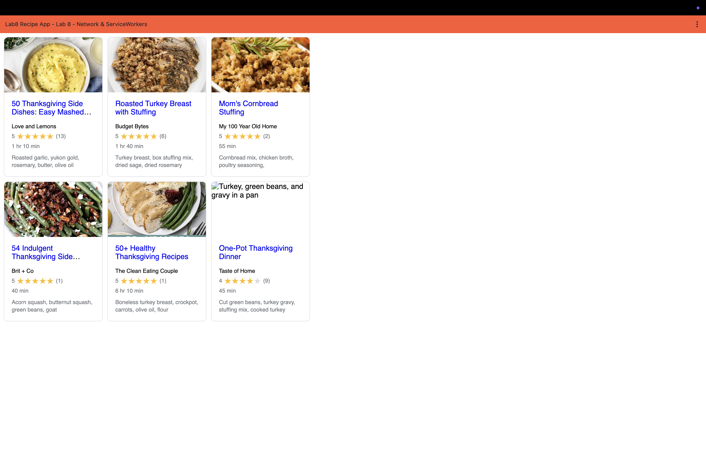

# Lab8-Starter
# Name - Zihan Zhang

Graceful degradation and service workers are closely related because service workers allow a web application to continue functioning even when newer or ideal conditions (like a stable internet connection) are not available. Instead of the app breaking when the network fails, the service worker can intercept requests and serve cached resources from the browser. This means the application “degrades gracefully” by still providing core functionality offline, rather than becoming unusable. In this way, service workers are a practical implementation tool that enables graceful degradation in modern web applications.

URL Link: https://laura8885.github.io/Lab8_Starter/
